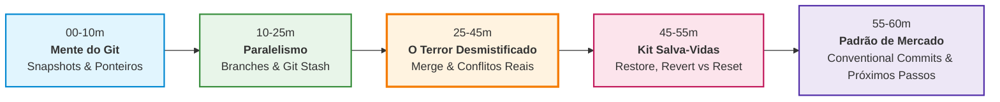
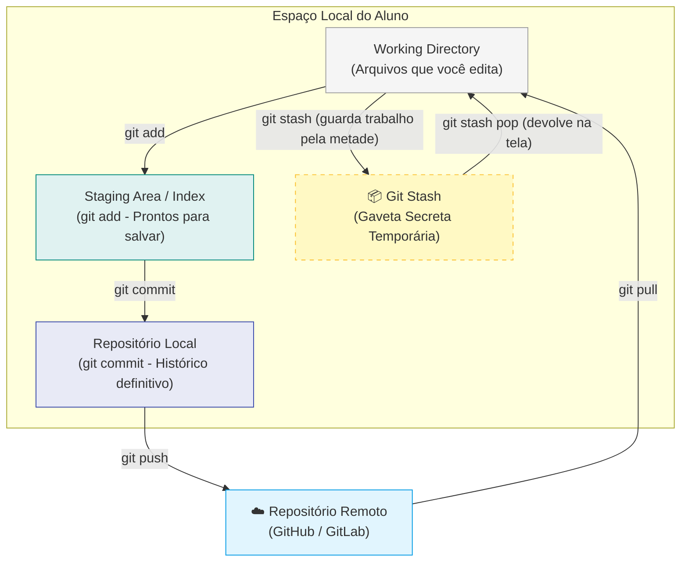
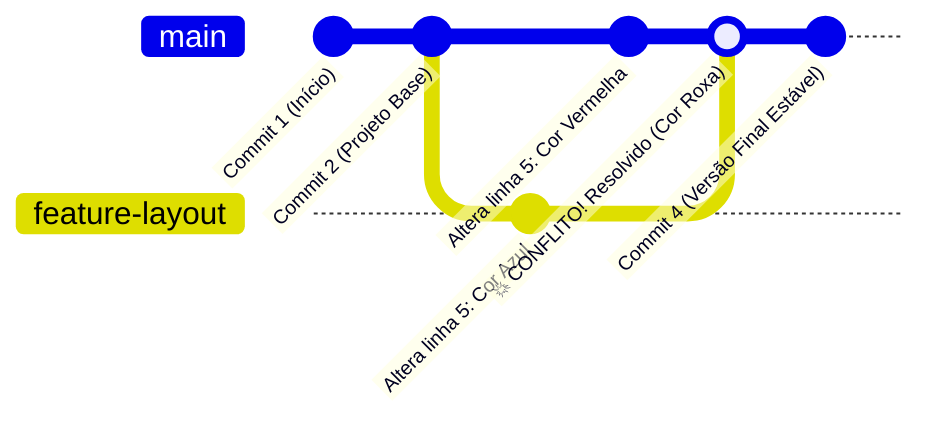
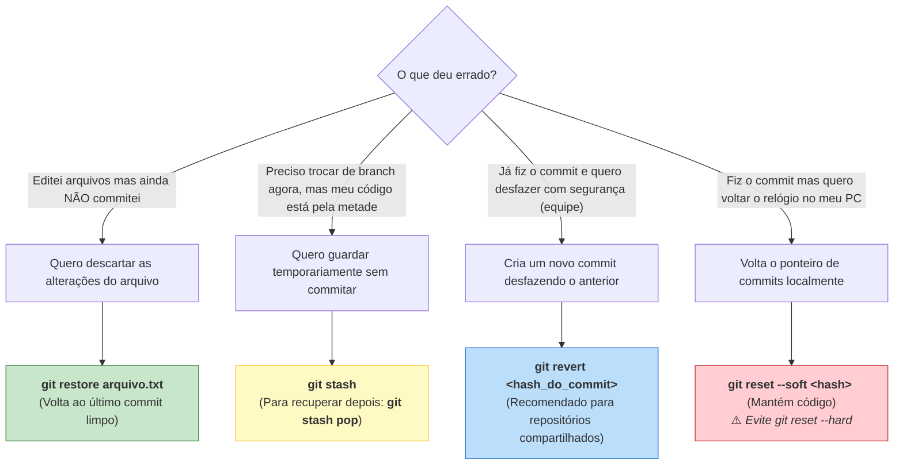

# 🔄 Fluxo do Conteúdo & Diagramas Visuais

Este documento apresenta os mapas conceituais e os fluxogramas da aula de 1h de **Git Avançado**. Use estes diagramas na sua apresentação ou imprima como mapa mental de apoio.

---

## 1. Cronograma & Fluxo da Aula (60 Minutos)



---

## 2. O Ciclo de Vida do Git & O "Armário Secreto" (Stash)

Como as alterações transitam no computador do desenvolvedor:



---

## 3. O Fluxo de Branches e Resolução de Conflitos

O que acontece quando duas pessoas ou branches alteram a mesma linha:



### Como o Git marca o Conflito:
```text
<<<<<<< HEAD (Sua branch atual: main)
Cor do Botão: Vermelha
=======
Cor do Botão: Azul
>>>>>>> feature-layout (Branch que você está trazendo)
```
**Ação do Aluno:** Apagar os marcadores e escolher:
```text
Cor do Botão: Roxa (ou uma das duas opções)
```

---

## 4. Guia Rápido: Qual Ferramenta Salva-Vidas Usar?


